# 🚀 Flujo de Desarrollo con flow.sh

## 📋 Resumen Rápido

El script `flow.sh` automatiza todo el flujo de desarrollo en Bukeer:

```bash
./flow.sh dev mi-feature  # Crear rama
./flow.sh run            # Ejecutar app (development)
./flow.sh staging        # Ejecutar app (staging)
./flow.sh save           # Guardar cambios
./flow.sh test           # Validar código
./flow.sh pr             # Crear PR
./flow.sh deploy         # Deploy (solo admins)
```

## 🛠️ Configuración Inicial

### Primera vez en el proyecto:
```bash
# Clonar repositorio
git clone https://github.com/weppa-cloud/bukeer-flutter.git
cd bukeer-flutter

# Dar permisos al script
chmod +x flow.sh

# Instalar dependencias
flutter pub get

# Ver todos los comandos disponibles
./flow.sh help
```

## 🔄 Flujo de Trabajo Completo

### 1. Inicio del día
```bash
# Sincronizar con últimos cambios
./flow.sh sync

# Ver estado actual
./flow.sh status
```

### 2. Nueva funcionalidad
```bash
# Crear rama desde main actualizado
./flow.sh dev nombre-descriptivo

# Ejecutar la aplicación
./flow.sh run              # Chrome (development)
./flow.sh run ios          # iOS simulator (development)
./flow.sh run android      # Android emulator (development)

# Ejecutar en staging
./flow.sh staging          # Chrome (staging) - atajo rápido
./flow.sh run chrome staging    # Chrome (staging)
./flow.sh run ios staging       # iOS (staging)
./flow.sh run android staging   # Android (staging)
```

### 3. Durante el desarrollo
```bash
# Guardar cambios (auto-commit inteligente)
./flow.sh save

# O con mensaje específico
./flow.sh save "feat: agregar filtro de búsqueda avanzada"

# Validar código
./flow.sh test
```

### 4. Finalizar tarea
```bash
# Asegurar que todo funciona
./flow.sh test

# Crear Pull Request
./flow.sh pr

# El PR se creará automáticamente en GitHub
```

### 5. Después de la revisión (Tech Lead)
```bash
# Deploy a producción
./flow.sh deploy
```

## 📖 Comandos Detallados

### `./flow.sh dev [nombre]`
- Actualiza desde main
- Crea rama `feature/nombre`
- Te posiciona en la nueva rama

### `./flow.sh save [mensaje]`
- Agrega todos los cambios
- Auto-genera mensaje de commit si no se proporciona
- Push automático a la rama remota

### `./flow.sh test`
- Ejecuta `flutter analyze` (errores críticos)
- Ejecuta tests si existen
- Valida que no hay problemas de compilación

### `./flow.sh pr`
- Verifica que la rama está actualizada
- Ejecuta tests automáticamente
- Crea PR con plantilla predefinida
- Usa GitHub CLI si está instalado

### `./flow.sh run [device] [environment]`
- Ejecuta la aplicación en el dispositivo especificado
- Dispositivos: chrome (default), ios, android
- Ambientes: development (default), staging
- Ejemplos:
  - `./flow.sh run` - Chrome en development
  - `./flow.sh run ios staging` - iOS en staging

### `./flow.sh staging`
- Atajo rápido para ejecutar en Chrome con ambiente staging
- Equivalente a: `./flow.sh run chrome staging`
- Usa API de staging: https://bukeer-staging.bukeerpro.com/api

### `./flow.sh sync`
- Obtiene últimos cambios de main
- Hace merge a tu rama actual
- Ayuda a resolver conflictos

### `./flow.sh clean`
- Lista ramas ya mergeadas
- Permite eliminarlas de forma segura
- Limpia referencias remotas obsoletas

## 🎯 Mejores Prácticas

### Commits frecuentes
```bash
# Guardar cada hora o cuando completes algo
./flow.sh save
```

### Nombres descriptivos
```bash
# Malo
./flow.sh dev fix

# Bueno
./flow.sh dev corregir-validacion-email
```

### Sincronización regular
```bash
# Al menos una vez al día
./flow.sh sync
```

## 🚨 Reglas Importantes

### ✅ SIEMPRE hacer:
1. Usar `flow.sh` para TODAS las operaciones git
2. Ejecutar `./flow.sh test` antes de PR
3. Sincronizar regularmente con main
4. Usar el sistema de diseño Bukeer

### ❌ NUNCA hacer:
1. Commits directos a main
2. Merge manual sin revisión
3. Incluir API keys o secrets
4. Usar FlutterFlowTheme (usar BukeerDesign)

## 🆘 Solución de Problemas

### Error: "Permission denied"
```bash
chmod +x flow.sh
```

### Error: "Cambios sin commit"
```bash
./flow.sh save
# O si quieres descartar cambios
git reset --hard
```

### Conflictos al sincronizar
```bash
# flow.sh te guiará, pero básicamente:
# 1. Editar archivos con conflictos
# 2. git add .
# 3. git commit
# 4. ./flow.sh save
```

### PR no se crea
```bash
# Instalar GitHub CLI
brew install gh       # macOS
gh auth login        # Autenticarse
```

## 📊 Flujo Visual

```mermaid
graph LR
    A[main] -->|flow.sh dev| B[feature/nueva]
    B -->|flow.sh save| C[commits]
    C -->|flow.sh test| D[validación]
    D -->|flow.sh pr| E[Pull Request]
    E -->|Review| F[Aprobado]
    F -->|flow.sh deploy| G[Producción]
```



## 🔗 Enlaces Relacionados

- [Estándares de Código](./coding-standards.md)
- [Proceso de Code Review](./code-review.md)
- [Sistema de Diseño](../03-architecture/design-system.md)
- [Guía de Testing](../04-guides/testing.md)

---

**Tip**: Ejecuta `./flow.sh help` en cualquier momento para ver ayuda rápida.