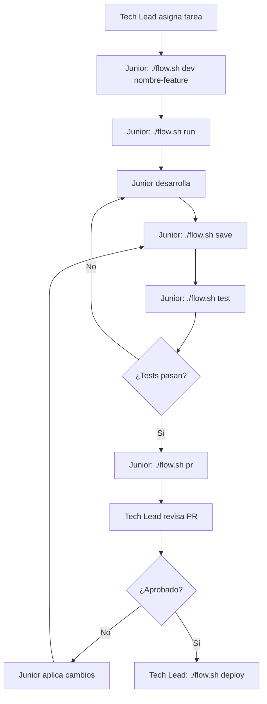

# =€ Guía de Onboarding para Desarrollador Junior - Bukeer

## =Ë Flujo de Trabajo con flow.sh

### <¯ Script Automatizado flow.sh

El proyecto incluye un script que simplifica TODO el flujo de trabajo:

```bash
# Dar permisos de ejecución (solo la primera vez)
chmod +x flow.sh

# Ver ayuda completa
./flow.sh help
```

### = Flujo de Desarrollo Simplificado



## =á Proceso Paso a Paso (Junior)

### 1. **Configuración Inicial (Solo Primera Vez)**
```bash
# Clonar repositorio
git clone https://github.com/weppa-cloud/bukeer-flutter.git
cd bukeer-flutter

# Dar permisos al script
chmod +x flow.sh

# Instalar dependencias
flutter pub get
```

### 2. **Flujo Diario de Desarrollo**

#### < Inicio del Día
```bash
# Sincronizar con los últimos cambios
./flow.sh sync

# Ver estado del proyecto
./flow.sh status
```

#### =€ Nueva Tarea
```bash
# 1. Crear rama para tu feature
./flow.sh dev agregar-filtro-productos

# 2. Ejecutar la aplicación
./flow.sh run              # Por defecto en Chrome
./flow.sh run ios          # En iOS
./flow.sh run android      # En Android
```

#### =¾ Durante el Desarrollo
```bash
# Guardar cambios frecuentemente (auto-commit)
./flow.sh save

# O con mensaje específico
./flow.sh save "feat: agregar filtro por categoría en productos"

# Verificar que todo está bien
./flow.sh test
```

#### =ä Finalizar Tarea
```bash
# 1. Asegurarte que todo funciona
./flow.sh test

# 2. Crear Pull Request
./flow.sh pr

# 3. Notificar al Tech Lead para revisión
```

## =« Reglas Críticas de Seguridad

### NUNCA hacer esto:
```dart
// L PROHIBIDO - API Keys
const apiKey = "sk-1234567890abcdef";

// L PROHIBIDO - URLs hardcodeadas
const prodUrl = "https://api.produccion.com";

// L PROHIBIDO - Sistema obsoleto
import 'package:bukeer/legacy/flutter_flow/flutter_flow_theme.dart';
FlutterFlowTheme.of(context).primaryText
```

### SIEMPRE hacer esto:
```dart
//  CORRECTO - Configuración externa
final apiKey = window.BukeerConfig.apiKey;

//  CORRECTO - Sistema de diseño nuevo
import 'package:bukeer/design_system/index.dart';
BukeerColors.textPrimary
```

## =Ë Checklist Diario del Junior

### Antes de Empezar:
- [ ] `./flow.sh sync` - Sincronizar con main
- [ ] `./flow.sh status` - Verificar estado limpio
- [ ] Leer la tarea asignada completamente
- [ ] Preguntar si hay dudas ANTES de empezar

### Durante el Desarrollo:
- [ ] `./flow.sh save` - Guardar cambios cada hora
- [ ] Usar SOLO el sistema de diseño Bukeer
- [ ] NO modificar archivos en `/backend/` sin permiso
- [ ] `./flow.sh test` - Verificar antes de cada save importante

### Antes del Pull Request:
- [ ] `./flow.sh test` - Todos los tests pasan
- [ ] Revisar que NO hay información sensible
- [ ] Screenshots si hay cambios visuales
- [ ] `./flow.sh pr` - Crear PR con descripción clara

## =h
=¼ Proceso de Revisión (Tech Lead)

### Comandos para Revisión:
```bash
# Ver PRs pendientes
gh pr list

# Revisar un PR específico
gh pr checkout [numero-pr]

# Ejecutar y probar localmente
./flow.sh run

# Aprobar y hacer deploy
gh pr merge [numero-pr]
./flow.sh deploy
```

### Checklist de Revisión:
1. **Seguridad**: No hay API keys, tokens o secretos
2. **Diseño**: Usa sistema Bukeer, no FlutterFlow
3. **Calidad**: Tests pasan, código limpio
4. **Funcionalidad**: Feature funciona como se espera

## <¯ Tareas de Práctica (Primeras Semanas)

### Semana 1: Familiarización
```bash
# Día 1-2: Setup y exploración
./flow.sh run
# Explorar la aplicación, entender navegación

# Día 3-4: Primer fix simple
./flow.sh dev mi-primer-fix
# Arreglar un typo o ajustar espaciado
./flow.sh save "fix: corregir typo en página de contactos"
./flow.sh pr

# Día 5: Práctica completa del flujo
./flow.sh dev practica-componente
# Crear un componente simple en /core/widgets/
```

### Semana 2: Componentes y Migración
```bash
# Migrar un componente de FlutterFlow a Bukeer
./flow.sh dev migrar-componente-x
# Buscar componentes que usen FlutterFlowTheme
# Migrarlos al sistema de diseño Bukeer
```

### Semana 3: Features Completas
```bash
# Implementar una feature pequeña completa
./flow.sh dev feature-filtros-avanzados
# Integrar con AppServices
# Agregar tests
```

## <˜ Cuando Pedir Ayuda

### Usa este formato para preguntas:
```
=4 BLOQUEO: [Descripción]
=Í Archivo: [path/al/archivo.dart]
<¯ Intenté: [qué intentaste]
S Error: [mensaje de error si hay]
```

### Canales de Comunicación:
- **Dudas rápidas**: Slack/Discord del equipo
- **Bloqueos**: Mensaje directo al Tech Lead
- **Code review**: Comentarios en el PR

## =Ê Métricas de Éxito (30 días)

### Para el Junior:
- [ ] 100% de desarrollo usando `flow.sh`
- [ ] 0 commits con información sensible
- [ ] 90%+ de PRs sin FlutterFlowTheme
- [ ] Mínimo 1 PR aprobado por semana
- [ ] Tests ejecutados antes de cada PR

### Para el Tech Lead:
- [ ] Revisión de PR en < 24 horas
- [ ] Feedback constructivo y educativo
- [ ] Deploy seguro sin vulnerabilidades

## =' Troubleshooting Común

### Error: "Permission denied"
```bash
chmod +x flow.sh
```

### Error: "flutter: command not found"
```bash
# Verificar instalación de Flutter
flutter --version
```

### Error al crear PR
```bash
# Instalar GitHub CLI
brew install gh  # En macOS
gh auth login    # Autenticarse
```

### Conflictos al sincronizar
```bash
# El script te guiará, pero básicamente:
# 1. Resolver conflictos en VS Code
# 2. git add .
# 3. git commit
# 4. ./flow.sh save
```

---

**Recuerda**: 
- =á La seguridad es PRIORIDAD #1
- <¨ SIEMPRE usar el sistema de diseño Bukeer
- =¬ Es mejor preguntar que romper algo
- =€ `flow.sh` es tu mejor amigo

¡Bienvenido al equipo! <‰